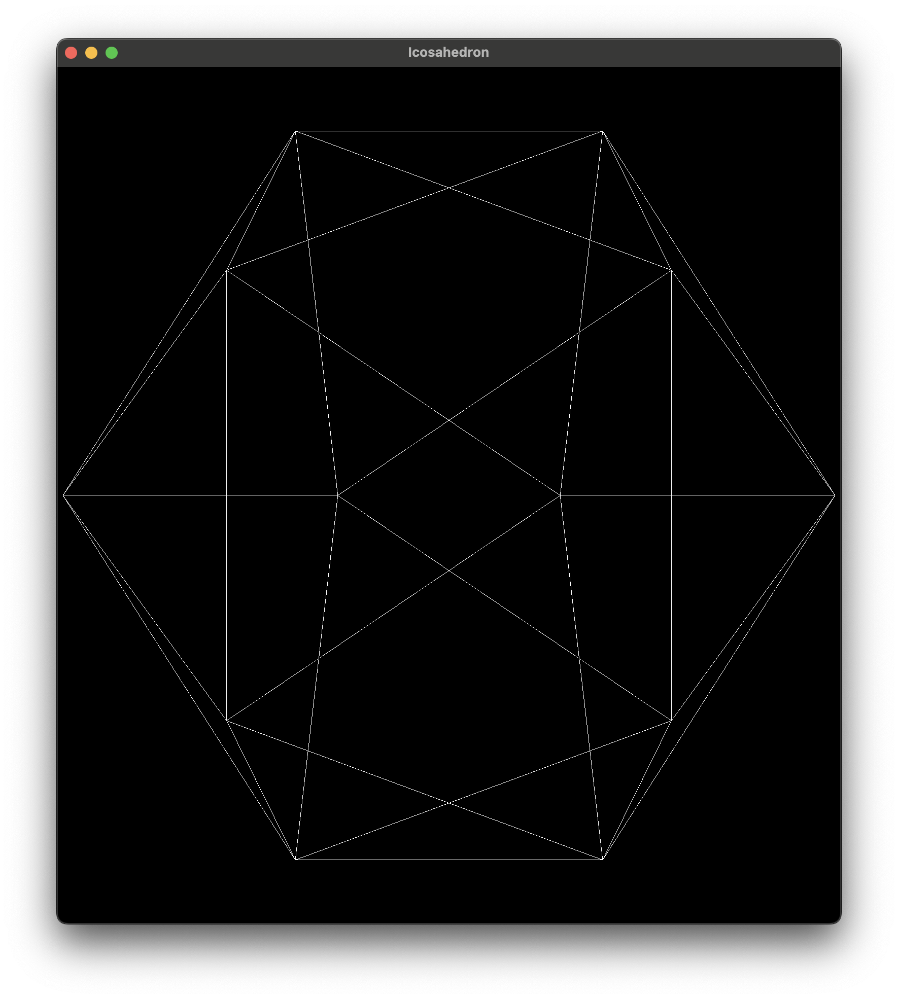
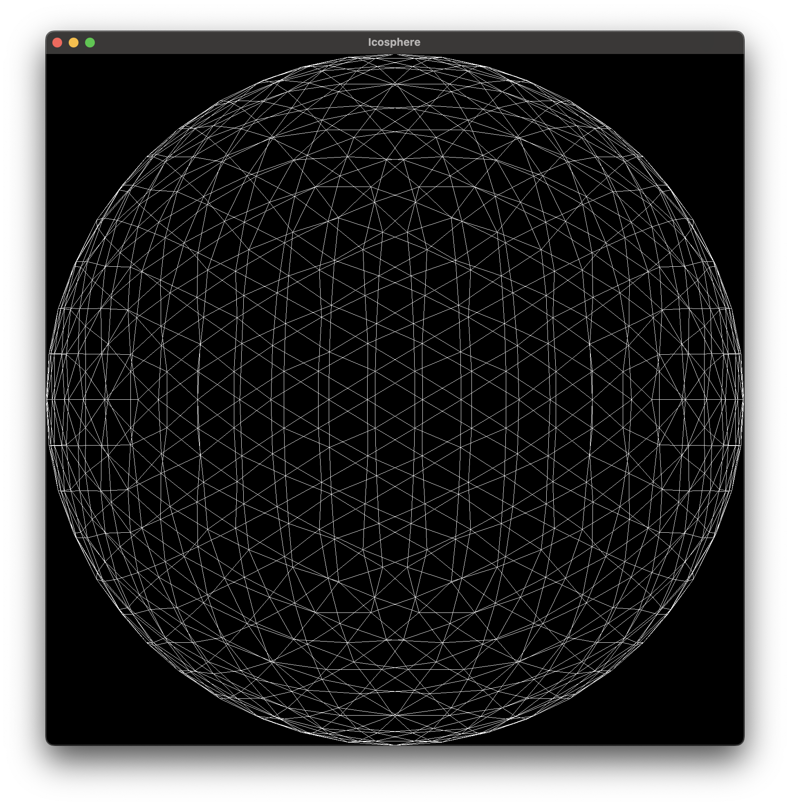

# Rust WGPU Demos
This repo is a labratory of wgpu experiments and a place to store
concrete implementations of GPU programming techniques.

All the demos compile down to a single binary that presents a cli for executing
them.

For example:

```
cargo run -- single-triangle
```

will display a single triangle.

or build the binary and run

```
demoscene single-triangle
```

## Demos

### Bare-Window
Shows a window with nothing on it. Illustrates basics of setting up a window
with the `winit` crate.

### Single Triangle
Renders a single triangle. Full wgpu rendering pipeline (albeit without best-practices).

### Icosahedron
First real demo. Shows a rotating icosahedron that was procedurally generated
on the CPU then rendered with `wgpu`. The generation of the icosahedron
struct uses no tables of magic numbers and only uses the constants phi and pi.

It generates the icosahedron by first solving for the half width and height
of a rectangle whose four corners are on the unit sphere and whose width to
height ratio is equal to phi (the golden ratio).

Then it generates 8 more points by rotating the initial rectangle.
- Rotation 1 is about x by 90 degrees then about y by 90 degrees.
- Rotation 2 is about z by 90 degreens then aboux x by 90 degrees.

Then it calculates the characteristic edge length of the icosahedron by taking
the minimimal possible edge between any two distinct points.

Once we have the edge (icosahedron only has one edge length) we can figure out
which vertices are connected by checking if their distance is equal to the edge length.

After building up the edges data structure, we build the faces data structure
by noticing that if point a is connected to point b and point c and point
b is connected to point c then points a, b, and c must form a triangle. We use
a hashset to deduplicate triangles and we orient the faces so that they point
outwards (cross product of two edges to get normal then dot with any vertex and flip
if the normal is not aligned).

Finally we pack the vertex points, vertex normals, and face indices into a GPU
friendly datastructure.

In production you'd just cache the resulting vertices and faces but wheres the
fun in that :P. 

During the rendering stage, we pass in a timestamp to the vertex shader and
use that to calculate an angle to rotate by.



### Icosphere


### Box Blur 2D
Box blur on images using a compute shader. This uses storage buffers
to represent the images and packs and un packs the 32 bit elements into
vec4. Using a storage texture would avoid this.

I also learned afterwards that wgsl has builtins for this:
```
fn pack4x8unorm(e: vec4<f32>) -> u32;
fn unpack4x8unorm(p: u32) -> vec4<f32>;
```

### Egui Inside
Shows how to embed an egui ui inside an existing winit + wgpu app